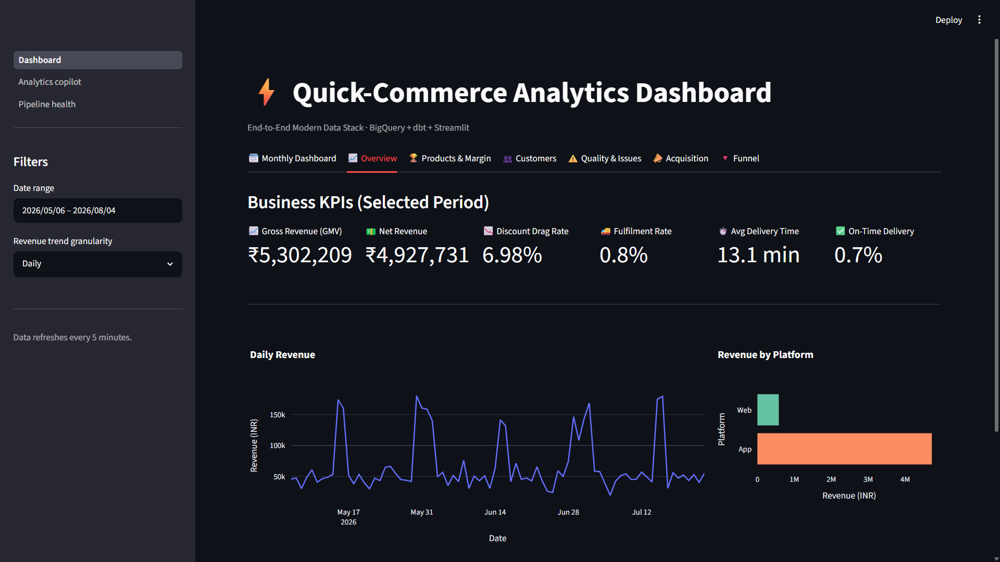
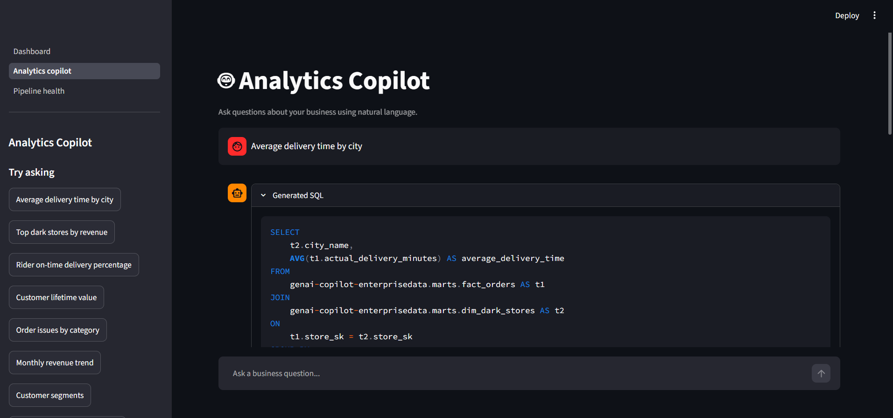

# GenAI-Powered Cloud Analytics Copilot for Quick-Commerce Data Warehousing

[](https://www.python.org/)
[](https://cloud.google.com/bigquery)
[](https://www.getdbt.com/)
[](https://airflow.apache.org/)
[](https://streamlit.io/)
[](https://deepmind.google/technologies/gemini/)

> An end-to-end Modern Data Stack analytics platform built around India's quick-commerce model (Zepto-style 10-minute delivery). The system generates realistic operational data, loads it into Google BigQuery, transforms it through a professional dbt pipeline (staging → intermediate → star schema), powers an executive BI dashboard with embedded churn prediction, and includes a schema-grounded natural language SQL copilot using Gemini AI.

---

## Table of Contents

- [Architecture](#architecture)
- [Data Model](#data-model)
- [Tech Stack](#tech-stack)
- [Project Structure](#project-structure)
- [Getting Started](#getting-started)
- [dbt Pipeline](#dbt-pipeline)
- [Dashboard Features](#dashboard-features)
- [AI Analytics Copilot](#ai-analytics-copilot)
- [Orchestration](#orchestration)

---

## Architecture

The project follows a standard Modern Data Stack (MDS) pipeline, heavily integrated with Google Cloud and AI:

1. **Data Generation & Ingestion**: Python Faker scripts simulate a fast-paced Zepto-style quick commerce dataset, dumping raw operational CSVs which are immediately ingested into BigQuery.
2. **Data Warehouse & Transformation**: Google BigQuery serves as the scalable backend, while `dbt Core` builds out a multi-layered transformation pipeline:
   - **Staging Layer**: Validates types, cleanses data, and sets schemas.
   - **Intermediate Layer**: Enriches orders, handles RFM (Recency, Frequency, Monetary) computations, and extracts churn features.
   - **Marts (Core)**: Exposes the primary analytical star schema (1 Fact table with 5 Dimension tables).
   - **Marts (Metrics)**: Pre-aggregated BI tables for extremely fast dashboard rendering.
3. **Serving Layer**: A Streamlit application provides a multi-tab BI dashboard. It interfaces with `scikit-learn` for ML-driven churn prediction, and utilizes Google's **Gemini AI** to act as a schema-grounded natural language SQL copilot.

---

## Data Model

The dataset simulates a **Zepto-inspired quick-commerce** operation across 16 Indian metro/tier-1 cities with dark stores, delivery riders, and a grocery/daily-essentials catalog.

### Raw Tables (9 tables)

| Table | Rows | Description |
|---|---|---|
| `dark_stores` | ~59 | Micro-fulfilment center locations with SKU capacity and delivery radius |
| `delivery_partners` | ~1,500 | Riders assigned to dark stores with vehicle types |
| `customers` | 20,000 | Customer profiles with Zepto Pass membership and home store |
| `products` | 5,000 | Grocery catalog with MRP, selling price, cost price, perishability |
| `orders` | 50,000 | Order headers with delivery promise, actual time, payment, platform |
| `order_items` | ~180,000 | Line items with quantity, unit price, substitution flag |
| `order_issues` | ~1,300 | Same-day issue resolution (no traditional "returns") |
| `events` | 300,000 | App/web clickstream (page_view, add_to_cart, reorder_click, purchase) |
| `marketing_spend` | ~6,500 | Daily spend across 5 acquisition channels |

### Star Schema (marts/core)

The core analytical schema follows a traditional dimensional model centered around a single unified fact table:

- **`fact_orders`** (Center): Connects to all dimensions via surrogate keys (`_sk`), storing INR financials, delivery KPIs, and basket metrics.
- **`dim_customers`**: RFM segments, value tiers, churn risk tiers, and Zepto Pass membership.
- **`dim_dark_stores`**: City/locality geography, operational volume tiers, and delivery performance tiers.
- **`dim_delivery_partners`**: Rider vehicle types, historical performance tiers, and experience levels.
- **`dim_products`**: Category naming, pricing tiers, margin health, and sales performance tags.
- **`dim_date`**: Calendar spine with Indian fiscal year (Apr-Mar) layouts and analytical flags.

---

## Tech Stack

| Layer | Technology | Role |
|---|---|---|
| **Data Generation** | Python, Faker (`en_IN`) | Simulates Zepto-style quick-commerce operational data |
| **Streaming & Messaging** | Apache Kafka, Kafka UI, Docker | Real-time event streaming (orders, delivery status, app events) |
| **Ingestion** | Python, `google-cloud-bigquery` | Batch loads CSVs into BigQuery `raw` dataset |
| **Data Warehouse** | Google BigQuery | Serverless, columnar cloud warehouse |
| **Data Modeling** | dbt Core 1.11+ | Staging → Intermediate → Star Schema → Metrics |
| **Orchestration** | Apache Airflow | DAG-based scheduling for ingestion and dbt runs |
| **Dashboard** | Streamlit, Plotly | Multi-tab executive BI dashboard |
| **Machine Learning** | scikit-learn | Logistic Regression churn prediction model |
| **Generative AI** | Gemini 1.5 Pro | Schema-grounded NL-to-SQL copilot with insight generation |
| **Infrastructure & Containers** | Terraform, Docker Compose | Cloud IaC and local containerized Kafka stack |

---

## Project Structure

```text
├── data/
│   ├── generate_data.py                # Master orchestrator (runs dimensions + facts)
│   ├── generate_dimensions.py          # Master / dimension table generator (stores, riders, customers, products)
│   ├── generate_facts.py               # Transactional / fact generator (orders, items, issues, events)
│   └── raw/
│       ├── dimensions/                 # Master / Dimension tables (static reference seeds)
│       │   ├── dark_stores.csv         # Micro-fulfilment center locations (~59 rows)
│       │   ├── delivery_partners.csv   # Rider partner master (~1,500 rows)
│       │   ├── customers.csv           # Customer profiles & Zepto Pass (~20,000 rows)
│       │   ├── products.csv            # Grocery SKU catalog & pricing (~5,000 rows)
│       │   └── marketing_spend.csv     # Daily acquisition spend (~9,000 rows)
│       └── facts/                      # Transactional / Fact tables (baseline historical)
│           ├── orders.csv              # Order headers (~50,000 rows)
│           ├── order_items.csv         # Order line items (~180,000 rows)
│           ├── order_issues.csv        # Customer issues & resolutions (~1,300 rows)
│           └── events.csv              # Clickstream activity (~300,000 rows)
│
├── infra/                              # Terraform Infrastructure as Code (IaC)
│   ├── main.tf                         # Main dataset resource definitions
│   ├── variables.tf                    # GCP project and region variables
│   ├── outputs.tf                      # Created dataset confirmation outputs
│   └── terraform.tfvars                # Project variable values
│
├── docker/                             # Containerized infrastructure
│   └── kafka/
│       ├── docker-compose.yml          # Kafka (KRaft), Kafka UI & init service
│       └── bootstrap_topics.sh         # Kafka topic creation & readiness script
│
├── streaming/                          # Real-time event streaming pipeline
│   ├── config.py                       # Central Kafka broker, topics & consumer groups
│   ├── schemas/                        # Event JSON schemas (data contracts)
│   │   ├── order_event.json            # Order header events (matches raw.orders)
│   │   ├── order_items_event.json      # Line-item events (matches raw.order_items)
│   │   ├── order_status_event.json     # Delivery lifecycle state transitions
│   │   ├── order_issue_event.json      # Customer issues & resolutions (matches raw.order_issues)
│   │   └── app_event.json              # Clickstream funnel events (matches raw.events)
│   ├── producers/                      # Event producers (Kafka publishers)
│   │   ├── order_producer.py           # Real-time customer checkout stream
│   │   ├── order_items_producer.py     # Line-item granular stream
│   │   ├── order_status_producer.py    # 10-minute delivery lifecycle stream
│   │   ├── order_issues_producer.py    # Post-delivery issue & resolution stream
│   │   └── app_event_producer.py       # User clickstream & browsing stream
│   └── consumers/                      # Topic consumers (Kafka subscribers)
│       ├── order_consumer.py           # Orders processor & live revenue tracker
│       ├── order_items_consumer.py     # Items sink & product sales aggregator
│       ├── order_status_consumer.py    # Delivery SLA & rider tracking
│       ├── order_issues_consumer.py    # Defect rate & quality monitoring
│       └── app_event_consumer.py       # Live conversion funnel analytics
│
├── loaders/
│   ├── load_to_bigquery.py             # CSV → BigQuery Ingestion (--dimensions-only / --facts-only)
│   └── setup_datasets.py               # (Alternative) Python setup helper for BQ
│
├── dbt/
│   ├── dbt_project.yml
│   ├── profiles.yml
│   ├── packages.yml                    # dbt_utils dependency
│   ├── macros/
│   │   ├── generate_schema_name.sql
│   │   └── safe_divide.sql
│   └── models/
│       ├── staging/                    # Layer 1: Type casting & validation
│       │   ├── _sources.yml
│       │   ├── stg_orders.sql
│       │   ├── stg_order_items.sql
│       │   ├── stg_customers.sql
│       │   ├── stg_products.sql
│       │   ├── stg_dark_stores.sql
│       │   ├── stg_delivery_partners.sql
│       │   ├── stg_order_issues.sql
│       │   ├── stg_events.sql
│       │   └── stg_marketing_spend.sql
│       ├── intermediate/               # Layer 2: Business logic & feature engineering
│       │   ├── int_orders_enriched.sql
│       │   ├── int_customer_orders.sql
│       │   ├── int_customer_churn_features.sql
│       │   └── int_product_revenue.sql
│       └── marts/
│           ├── core/                   # Layer 3: Star schema
│           │   ├── _core_models.yml
│           │   ├── fact_orders.sql
│           │   ├── dim_customers.sql
│           │   ├── dim_products.sql
│           │   ├── dim_dark_stores.sql
│           │   ├── dim_delivery_partners.sql
│           │   └── dim_date.sql
│           └── metrics/                # Layer 4: Pre-aggregated BI tables
│               ├── revenue_daily.sql
│               ├── customer_ltv.sql
│               ├── product_performance.sql
│               ├── marketing_performance.sql
│               ├── conversion_rate.sql
│               └── funnel_stages.sql
│
├── airflow/
│   └── dags/
│       ├── ingestion_dag.py            # Schedules data generation + BigQuery load
│       └── dbt_dag.py                  # Runs dbt build + test pipeline
│
├── streamlit/
│   ├── Dashboard.py                    # Main multi-tab Streamlit application
│   ├── pages/
│   │   ├── Analytics_copilot.py        # AI-powered natural language querying
│   │   └── Pipeline_health.py          # dbt pipeline monitoring
│   ├── components/
│   │   ├── charts.py                   # Plotly chart configurations
│   │   └── kpi_cards.py                # Custom KPI card components
│   ├── utils/
│   │   ├── bq_client.py                # BigQuery connection wrapper
│   │   ├── queries.py                  # SQL query library for dashboard tabs
│   │   ├── churn_model.py              # Logistic Regression training & inference
│   │   └── health_check.py             # Pipeline health monitoring utilities
│   └── ai/
│       ├── gemini_client.py            # Gemini API wrapper
│       ├── schema_context.py           # Dynamic dbt schema extraction
│       ├── prompt_builder.py           # Prompt engineering for SQL generation
│       ├── prompts.py                  # Prompt templates
│       ├── ai_sql_generator.py         # Question → SQL translation
│       ├── ai_sql_validator.py         # SQL injection & syntax validation
│       ├── insight_generator.py        # Executive summary generation
│       └── response_parser.py          # Gemini response parsing
│
├── .env.example                        # Environment variable template
├── requirements.txt
└── README.md
```

---

## Getting Started

### Prerequisites

- Python **3.11+**
- **Docker & Docker Compose** (for Kafka event streaming & Kafka UI)
- A GCP project with the **BigQuery API** enabled
- A service account JSON with `BigQuery Admin` permissions
- dbt Core **1.11+** with the `dbt-bigquery` adapter

### 1. Clone & Install

```bash
git clone <repository_url>
cd GenAI-Powered-Cloud-Analytics-Copilot
python -m venv venv
venv\Scripts\activate          # Linux/Mac: source venv/bin/activate
pip install -r requirements.txt
```

### 2. Configure Environment

```bash
copy .env.example .env         # Linux/Mac: cp .env.example .env
```

Edit `.env` with your GCP project ID and path to the service account JSON:

```env
GCP_PROJECT_ID=your-gcp-project-id
GOOGLE_APPLICATION_CREDENTIALS=path/to/service-account.json
GEMINI_API_KEY=your-gemini-api-key
```

### 3. Provision BigQuery Datasets & Load Data

You can set up your BigQuery datasets using **Terraform (recommended)** or the alternative python setup script.

#### Option A: Using Terraform (Recommended)
Make sure you have Terraform installed and GCP authenticated (either via `GOOGLE_APPLICATION_CREDENTIALS` or login).
```bash
cd infra
terraform init
terraform apply -var="project_id=your-gcp-project-id"
cd ..
```

#### Option B: Using Python Setup Script
```bash
python loaders/setup_datasets.py
```

#### Load Data
After provisioning the datasets:
```bash
# 1. Generate master dimension tables (stores, riders, customers, products, marketing)
python data/generate_dimensions.py

# 2. Generate baseline transactional facts (orders, items, issues, clickstream)
python data/generate_facts.py

# (Or run both together: python data/generate_data.py)

# 3. Load CSVs into BigQuery raw dataset (supports --dimensions-only or --facts-only)
python loaders/load_to_bigquery.py
```

### 4. Start Real-Time Event Streaming (Kafka & Docker)

Spin up Apache Kafka (KRaft mode), topic bootstrap automation, and Kafka UI:

```bash
cd docker/kafka
docker compose up -d
cd ../..
```

- **Kafka Broker (Host)**: `localhost:9092`
- **Kafka UI Dashboard**: [http://localhost:8080](http://localhost:8080)
- The `init-kafka` container automatically creates topics (`quickcommerce.orders`, `quickcommerce.order_status`, `quickcommerce.app_events`).

### 5. Run dbt Pipeline

```bash
cd dbt
dbt deps
dbt run
dbt test
cd ..
```

### 6. Launch Dashboard

```bash
cd streamlit
streamlit run Dashboard.py
```

Open `http://localhost:8501` to access the dashboard and AI Copilot.

---

## dbt Pipeline

The dbt project follows the **staging → intermediate → marts** layered architecture:

### Layer Breakdown

| Layer | Materialization | Dataset | Purpose |
|---|---|---|---|
| **Staging** | `view` | `staging` | Type casting, cleaning, null filtering — no business logic |
| **Intermediate** | `view` | `staging` | Enriched orders, RFM scoring, churn features, product profitability |
| **Marts: Core** | `table` | `marts` | Star schema: 1 fact table + 5 dimension tables |
| **Marts: Metrics** | `table` | `metrics` | Pre-aggregated tables optimized for dashboard queries |

### Key Intermediate Models

| Model | Purpose |
|---|---|
| `int_orders_enriched` | Joins all 6 staging models into a single wide order fact with delivery KPIs, basket tiers, and INR financials |
| `int_customer_orders` | Customer-level RFM scoring with 8 segments (Champions → Lost Customers) |
| `int_customer_churn_features` | Feature vector comparing lifetime vs last-30-day behaviour for churn prediction |
| `int_product_revenue` | Product profitability with margin analysis, substitution rates, and velocity metrics |

### Quick-Commerce KPIs Tracked

- **Delivery Performance**: Promised vs actual delivery time, on-time %, delay buckets (0-10 / 11-15 / 16-20 / 20+ min)
- **Dark Store Operations**: Order volume, rider fleet composition, delivery performance tier per store
- **Basket Economics**: AOV, basket size tiers (Micro/Small/Medium/Large), discount depth
- **Customer Health**: RFM segments, churn risk tiers, Zepto Pass impact, issue rates
- **Product Quality**: Substitution rates, issue rates per product, margin health, velocity (units/day)

---

## Dashboard Features
### Dashboard Preview

<p align="center">
  
</p>

The Streamlit dashboard provides executive-level insights across revenue, customers, products, marketing, and churn prediction.
### Multi-Tab Executive Dashboard

| Tab | Key Metrics |
|---|---|
| **Overview** | Revenue trends, order velocity, AOV, delivery on-time rate, fulfilment rate |
| **Products** | Category performance, margin health, substitution rates, top/bottom sellers |
| **Customers** | RFM segmentation, value tiers, churn risk distribution, pass member analysis |
| **Marketing** | Channel-level spend, ROAS, CAC, cost-per-install, click-through rates |
| **Funnel** | Page view → Add to cart → Reorder click → Purchase conversion rates |
| **Pipeline Health** | dbt model status, data freshness, row counts, test results |

### Predictive Churn Modeling

- **Feature Engineering**: dbt intermediate models compute AOV trends, delivery experience trends, issue rate changes, and app engagement metrics over a 30-day window
- **Model**: scikit-learn Logistic Regression with `StandardScaler` normalization
- **Risk Tiers**: Active / Medium Risk / High Risk / Churned / Dormant
- **Business Output**: At-risk LTV quantification and top high-risk customer profiles

---

## AI Analytics Copilot

The copilot translates natural language business questions into validated BigQuery SQL, executes them, and generates executive-ready insights.

**Example queries:**
- *"Which dark store had the highest on-time delivery rate last month?"*
- *"Show me revenue trend by category for Q1 2025"*
- *"What is the average delivery time for pass members vs non-pass members?"*
### Copilot Dashboard Preview

<p align="center">
  
</p>

The analytics copilot dashboard
### Query Execution Flow

1. **User asks question**: E.g., *"What was the conversion rate trend last month?"*
2. **Schema context loading**: The app dynamically fetches the latest tables, columns, and relationships from the dbt models.
3. **AI SQL Generation**: Gemini API receives the prompt (question + schema context) and generates syntactically valid BigQuery SQL.
4. **Validation**: Internal validator checks for SQL injection, `DROP/DELETE` statements, and syntax errors.
5. **Execution**: Validated SQL executes securely on BigQuery, returning a Pandas DataFrame.
6. **Insight Generation**: The raw DataFrame + original question are passed back to Gemini, which generates a natural language executive summary.
7. **Rendering**: The UI displays the raw data table, an interactive Plotly chart, and the AI-generated insights.

---

## Orchestration

Two Airflow DAGs manage the daily pipeline:

| DAG | Schedule | Workflow |
|---|---|---|
| **Ingestion DAG** | Daily | Task 1: Generate synthetic data → Task 2: Load to BigQuery `raw` dataset |
| **dbt DAG** | Triggered by Ingestion DAG | Task 1: `dbt run` → Task 2: `dbt test` → Task 3: `dbt docs generate` |

---

<p align="center">
  Built with ☕ and BigQuery from India
</p>
